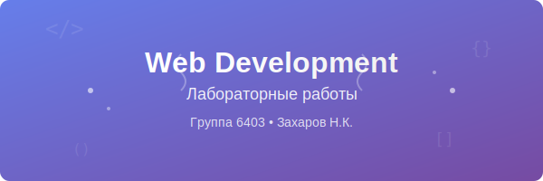

# Лабораторные работы по веб-программированию

## Информация о студенте

**ФИО:** Захаров Н.К.  
**Группа:** 6403  
**Научный руководитель:** Матвеева Ирина Александровна  
**Тема диплома:** Реализация и исследование решения задачи распознавания новообразований кожи на дерматоскопических изображениях

## Философская мудрость

> "Если бы нас пугала в смерти мысль о небытии, то мы должны были бы испытывать такой же испуг при мысли о времени, когда нас еще не было."  
> — *Артур Шопенгауэр*

---

## О репозитории

Данный репозиторий содержит лабораторные работы по курсу "Веб-программирование". Здесь будут размещены все выполненные задания и проекты в рамках изучения современных веб-технологий.

### Мотивация разработчика 🚀

**Преподаватель на лабораторной по веб-программированию:**
> *"Через час те из вас, кто останется в живых, будут завидовать мертвым"*

*Когда понимаешь, что впереди дедлайн по всем лабораторным, а ты еще даже Git не настроил... 💀*

## Контакты

- **GitHub:** [CrucifiedOnTheCross](https://github.com/CrucifiedOnTheCross)
- **Репозиторий:** [web6403-zakharov_nk](https://github.com/CrucifiedOnTheCross/web6403-zakharov_nk.git)

---

*Путь в веб-разработке начинается с первого коммита...*

## Лабораторная работа №2 — Web-программирование (HTML + CSS)

Тема: классификация злокачественных образований с помощью CNN (сверточные нейронные сети).

- Папка сайта: `lab2/`
- Страницы: `index.html`, `dataset.html`, `model.html`, `results.html`
- Стили: `lab2/styles.css` (единый подключаемый файл)
- Тематика: тёмная цветовая тема с синими акцентами

### Как проверить локально
- Запустите локальный сервер из корня репозитория:
  - `python -m http.server 8000`
- Откройте в браузере: `http://localhost:8000/lab2/index.html`

### Соответствие требованиям
- Количество страниц: 4
- HTML:
  - Блочные и строчные элементы используются (разметка секций, параграфов, `span`, `a`, и т.д.)
  - Ссылки: есть внутренняя навигация и внешняя ссылка на Kaggle
  - Картинка: баннер на главной (`assets/web-development-banner.svg`)
  - Таблица: на странице `dataset.html` с выравниваниями
- CSS:
  - Отдельный подключаемый файл: `lab2/styles.css`
  - Минимум 3 вида селекторов: элементные (`body`, `table`), классовые (`.card`, `.align-left`), ID (`#hero`), атрибутные (`a[href^="http"]`), псевдоклассы (`:hover`)
  - Использование цвета: тёмная тема, акцентный синий (`--accent`)
  - Выравнивания в таблице: классы `.align-left`, `.align-center`, `.align-right`

### Порядок выполнения по Git (для отчёта)
1. Создать ветку `lab2` от `main`/`master`
2. Добавить файлы лабораторной №2 (папка `lab2`) и обновить `README.md`
3. Создать Pull Request из `lab2` в `main`/`master` и выполнить слияние

Перед коммитом и PR просьба визуально проверить сайт через предпросмотр.